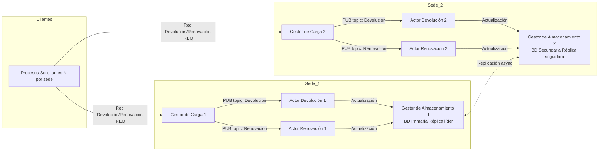

# 📘 Sistema Distribuido de Préstamo, Renovación y Devolución de Libros

Autores: Gabriel Jaramillo Cuberos, Roberth Méndez, Mariana Osorio, Juan Esteban Vera

## 🧩 Descripción general
Este proyecto implementa un sistema distribuido para la gestión de préstamos, devoluciones y renovaciones de libros en una biblioteca con múltiples sedes.
La arquitectura se basa en ZeroMQ (JeroMQ para Java) y usa los patrones REQ/REP y PUB/SUB para permitir comunicación entre los componentes.

## 🏗️ Arquitectura del sistema

## 🖥️ Despliegue

### Requisitos:

Java 17 o superior
Librería JeroMQ
Dos o más máquinas en red local (LAN)
Archivos CSV y de carga en la carpeta data/

### Estructura de carpetas:
Lab3/
│── src/
│   ├── GC.java
│   ├── PS.java
│   ├── Actor.java
│   ├── GA.java
│   ├── Persistencia.java
│── data/
│   ├── libros.csv
│   ├── carga_ps1.txt
│── logs/
│── README.md

## ⚙️ Ejecución paso a paso
1. Compilar
2. Ejecutar

## 📊 Pruebas y métricas

Casos verificados:
- Devolución procesada en tiempo real.
- Renovación aceptada máximo 2 veces.
- Renovación 3ª vez → “Límite de renovaciones alcanzado”.
- Respuesta inmediata del GC (< 100 ms).
- Actualización visible en GA y CSV.

### Métricas recolectadas:
- Latencia promedio GC→Actor→GA.
- Throughput de mensajes/s.
- % de errores o pérdidas.
