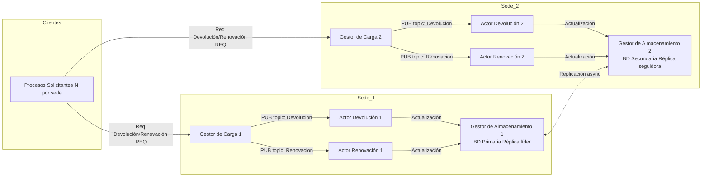
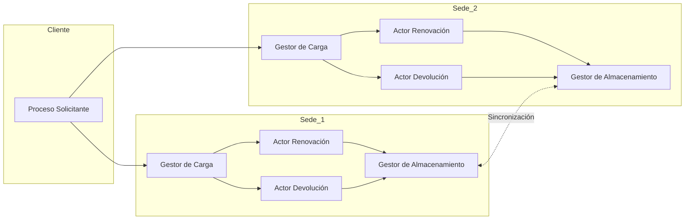
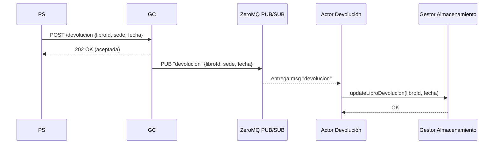
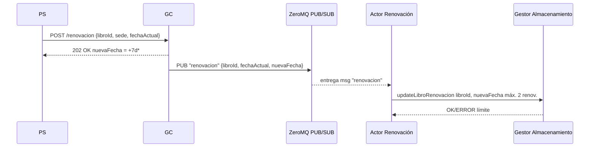
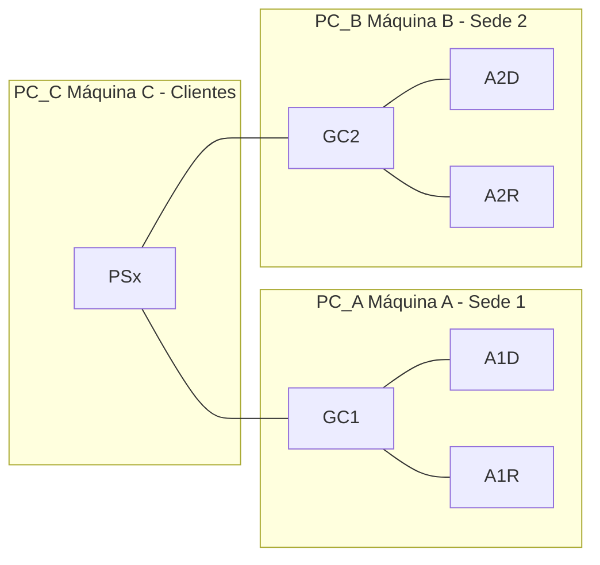
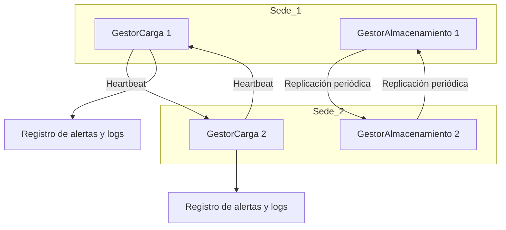
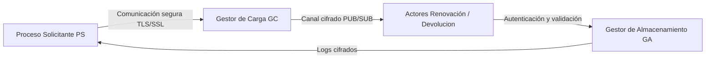

# 📘 Sistema Distribuido de Préstamo, Renovación y Devolución de Libros

Autores: Gabriel Jaramillo Cuberos, Roberth Méndez Rivera, Mariana Osorio Vásquez, Juan Esteban Vera Garzón 

## 🧩 Descripción general
Este proyecto implementa un sistema distribuido para la gestión de préstamos, devoluciones y renovaciones de libros en una biblioteca con múltiples sedes.
La arquitectura se basa en ZeroMQ (JeroMQ para Java) y usa los patrones REQ/REP y PUB/SUB para permitir comunicación entre los componentes.

## 🏗️ Arquitectura del sistema



## Diagrama de componentes 

## Interacción
### Devolución 

### Renovación

## 🖥️ Despliegue
### Diagrama de despliegue


### Requisitos:

Java 17 o superior
Librería JeroMQ
Dos o más máquinas en red local (LAN)
Archivos CSV y de carga en la carpeta data/

### Estructura de carpetas:
```
Lab3/
│── src/
│   ├── Gestor_Almacenamiento/
|        ├──BaseDatos.java
|        ├──Ejemplar.java
|        ├──GestorAlmacenamiento.java
|        ├──GestorAlmacenamientompl.java
|        ├──Libro.java
|        ├──ServidorGA.java
|   ├── Gestor_Carga/
|        ├──ActorClient.java
|        ├──BibliotecaGC.java
|        ├──BibliotecaGClmpl.java
|        ├──Message.java
|        ├──ServidorGC.java
│   ├── ClienteBatch.java
│   ├── libros.txt
│   ├── peticiones.txt
│── README.md
```
## Diagrama de fallos 

## Modelo de seguridad 


## ⚙️ Ejecución paso a paso
1. Compilar
2. Ejecutar

## 📊 Pruebas y métricas

Casos verificados:
- Devolución procesada en tiempo real.
- Renovación aceptada máximo 2 veces.
- Renovación 3ª vez → “Límite de renovaciones alcanzado”.
- Respuesta inmediata del GC (< 100 ms).
- Actualización visible en GA y CSV.

### Métricas recolectadas:
- Latencia promedio GC→Actor→GA.
- Throughput de mensajes/s.
- % de errores o pérdidas.
